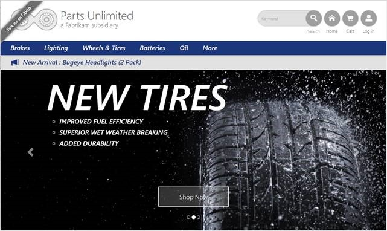

# Challenge 0 : Setup: Deploy the &quot;on premises&quot; environment

**Duration**: 40 minutes

For this challenge, we simply want to create an environment that represents a typical "on-premises" footprint.  We'll deploy these assets directly from the repository into Azure VMs.  Then we'll verify connectivity from your workstation via Remote Desktop.

## Set up the environment

### Tasks to complete

1. Deploy the environment template to Azure VMs. Once the deployment is complete, review the vmweb01 configuration to find the public URL.  Browse to that url to verify that everything worked correctly.
2. Verify connectivity to the development VM via RDP
3. Sign in to Visual Studio on the development VM

**Note** :

> Default Username: sysadmin  
> Default Password: Password$123

### Exit criteria

1. Verify the website runs without error  

 

**Note** :

> Be sure and copy the URL of the newly created web site for use later

## Help references
|                    |                                                                                                                  |
| ------------------ | ---------------------------------------------------------------------------------------------------------------- |
| Azure Templates    | [https://azure.microsoft.com/en-us/resources/templates/](https://azure.microsoft.com/en-us/resources/templates/) |
| PowerShell Gallery | [http://www.powershellgallery.com/](http://www.powershellgallery.com/)                                           |

---  
# Challenge 1 Migrate to Azure App Services

**Duration**: 20 minutes

Now that the environment is set up, we need to make sure we can connect to the development environment where we will be doing the exercises for this workshop.  The goal is to migrate the Parts Unlimited site to Azure without the need for VMs.

There are multiple options to perform migrations such as Azure Migrate or from the "Publish" command within Visual Studio.

For this challenge, we'll be using the Azure App Service Migration tool.

## Exit criteria

1. The Parts Unlimited website runs successfully on Azure App Services
2. We can "Stop" the VM VMWEB01 without interrupting the Parts Unlimited application running on App Services

## Help references

|                                      |                                                                                                                                                                        |
| ------------------------------------ | :--------------------------------------------------------------------------------------------------------------------------------------------------------------------- |
| Azure App Service Overview           | [https://docs.microsoft.com/en-us/azure/app-service/](https://docs.microsoft.com/en-us/azure/app-service/)                                                             |
| Migrate to Azure App Service         | [https://appmigration.microsoft.com/readiness/](https://appmigration.microsoft.com/readiness/)                                                                         |
| Azure App Service Hybrid Connections | [https://docs.microsoft.com/en-us/azure/app-service/app-service-hybrid-connections](https://docs.microsoft.com/en-us/azure/app-service/app-service-hybrid-connections) |

---
# Challenge 2 Migrate to Azure SQL Database

**Duration**: 20 minutes

We've now successfully migrated the web app portion of Parts Unlimited to Azure App Services, and we can now decommision the VMWEB1 machine.  However, the migration tool that we used does not migrate data from the database, rather, it uses a technology called "Hybrid Connections" to allow for web applications in Azure to "reach back" to on-premises databases to interact with the necessary databases.

For this challenge, we'll be using the Azure Data Migration Assistant.

## Exit criteria

1. The Parts Unlimited website runs successfully on Azure App Services, without the need for a VM database host
2. We can "Stop" the VM VMDB01 without interrupting the Parts Unlimited application running on App Services

## Help references

|                                     |                                                                                                                                                  |
| ----------------------------------- | :----------------------------------------------------------------------------------------------------------------------------------------------- |
| Data Migration Assistant Overview   | [https://docs.microsoft.com/en-us/sql/dma/dma-overview](https://docs.microsoft.com/en-us/sql/dma/dma-overview)                                   |
| Data Migration Assistant Download   | [https://www.microsoft.com/en-us/download/details.aspx?id=53595](https://www.microsoft.com/en-us/download/details.aspx?id=53595)                 |
| Azure SQL Database                  | [https://docs.microsoft.com/en-us/azure/sql-database/](https://docs.microsoft.com/en-us/azure/sql-database/)                                     |
| Configure apps in Azure App Service | [https://docs.microsoft.com/en-us/azure/app-service/web-sites-configure](https://docs.microsoft.com/en-us/azure/app-service/web-sites-configure) |

---

# Challenge 3: Migrate source code to Azure DevOps

Parts Unlimited has a manual deployment process and wants to improve this to enable more agility with the goal to rapidly deliver value in minutes as opposed to weeks or months.

Let's implement a CI/CD process from Azure Pipelines which will enable us to quickly deploy changes to production with full traceability.  Starting from this foundation, we can add unit testing, automated UI testing, Load Testing, Manual Testing, approval processes, etc. to ensure you do not sacrifice quality for speed.

We'll need to perform the following tasks:

1. Clone this repo via git
2. Create a new project in Azure DevOps
3. Push the code to the new project via git

## Prerequisites

You have (or create) an Azure DevOps organization and be able to create new projects within it. 

## Help references

|                                    |                                                                                                                                                                                                                           |
| ---------------------------------- | ------------------------------------------------------------------------------------------------------------------------------------------------------------------------------------------------------------------------- |
| Azure DevOps                       | [https://azure.microsoft.com/en-us/services/devops/](https://azure.microsoft.com/en-us/services/devops/)                                                                                                                  |
| Azure Pipelines                    | [https://azure.microsoft.com/en-us/services/devops/pipelines/](https://azure.microsoft.com/en-us/services/devops/pipelines/)                                                                                              |
| Quickstart: Create an organization | [https://docs.microsoft.com/en-us/azure/devops/organizations/accounts/create-organization?view=azure-devops] (https://docs.microsoft.com/en-us/azure/devops/organizations/accounts/create-organization?view=azure-devops) |

# Challenge 4:Implement DevOps Continuous Integration / Continuous Deployment (CI/CD)

We'll need to perform the following tasks:

1. Setup CI/CD via Deployment Center
or
2. Setup CI/CD via Azure DevOps

|                                      | [https://www.visualstudio.com/team-services/](https://www.visualstudio.com/team-services/)                                                                                                 |
| ------------------------------------ | ------------------------------------------------------------------------------------------------------------------------------------------------------------------------------------------ |
| Visual Studio Team Services CI/CD    | [https://docs.microsoft.com/en-us/azure/virtual-machines/windows/tutorial-vsts-iis-cicd](https://docs.microsoft.com/en-us/azure/virtual-machines/windows/tutorial-vsts-iis-cicd)           |
| Visual Studio Team Services Creation | [https://docs.microsoft.com/en-us/vsts/accounts/create-account-msa-or-work-student?view=vsts](https://docs.microsoft.com/en-us/vsts/accounts/create-account-msa-or-work-student?view=vsts) |

---
# Challenge 4: Detect, Diagnose, Monitor Application Performance with Azure App Insights

Parts Unlimited understands that bad experiences online will quickly drive a customer to your competitor.  With that in mind, they want to gain better visibility into issues customers are experiencing while using their site.

In addition to gaining better insights into the sites health, they are also interested in better understanding how customers are using the site and the sites effectiveness.

As there is no instrumentation on the site today, they have decided to add Application Insights telemetry.

Timely actionable telemetry is an important aspect of any modern application.  Actionable information is a vital component of any DevOps practice.

- Add Application Insights to the web app
- Modify the code to instrument the app
- Test locally to verify the app works
- Push the changes to kick off a release
- Test that the production application works
- Review App Insights Data

## Prerequisites

To complete this task, you should have provisioned the Parts Unlimited IaaS and PaaS environments (Exercise 1).  You will use the Developer Workstation deployed as part of the IaaS environment for your development work.

You must also have a Visual Studio Team Services Account and be able to create new projects within that account.  If you don&#39;t, you will need to setup a new Account.

## Help references

| Azure Application Insights | [https://docs.microsoft.com/en-us/azure/application-insights/app-insights-overview](https://docs.microsoft.com/en-us/azure/application-insights/app-insights-overview) |
| -------------------------- | ---------------------------------------------------------------------------------------------------------------------------------------------------------------------- |

---
# Challenge 5: Optimize and Protect App

While the default settings for deploying web application may work in many situations, we want to examine our Azure App Service Web Application and ensure its secure, optimized, and able to meet the demands of our customers. We will use the Azure portal to configure the ensure backups, logging is enabled, and the application is sized and can scale as need.

This lab will demonstrate how to safe guard and protect your application and make it available by:

- Resource Group cannot be deleted by creating a lock
- Configure backups are setup with 120-day retention
- Ensure the average response time is \&lt; 2 seconds
- Configure alerts exist for CPU \&lt; 90 secs
- Configure diagnostics and exception logging is configured
- Ensure the average CPU \&lt; 20%
- Verify that there&#39;s 35 GB free space available
- Scale up to a premium hosting model with \&gt; 3GB RAM available

Azure App Service services keeps you informed about the state of your application. It provides the ability to safe guard the application by performing automatic backups, provides a consolidate method for collection information about your application, has the ability of scaling up/down and notifying you when it does.

## Prerequisites

To complete this task, you should have provisioned the Parts Unlimited IaaS and PaaS environments and have a working CI/CD process and have installed &amp; configure Azure Application Insights.  You have logged in and have configured Visual Studio and able to modify code.

## Help references

| Web Site Backup | [https://docs.microsoft.com/en-us/azure/app-service/web-sites-backup](https://docs.microsoft.com/en-us/azure/app-service/web-sites-backup)                         |
| --------------- | ------------------------------------------------------------------------------------------------------------------------------------------------------------------ |
| Auto Scaling    | [https://docs.microsoft.com/en-us/azure/architecture/best-practices/auto-scaling](https://docs.microsoft.com/en-us/azure/architecture/best-practices/auto-scaling) |

---
# Challenge 6: Optimize &amp; Protect Data

While the default settings for deploying SQL database may work in many situations, we want to examine the database and ensure its secure, optimized, and able to meet the demands of our customers. We will use the Azure portal to configure the ensure tuned, diagnostics is enabled, and the database is sized and can scale as need.

This exercise will demonstrate how to safe guard and protect your database and make it available by:

- Database DTU utilization is \&lt; 20%
- \&gt;= 3000 DTUs are available for the database
- Database is accessible only from Azure (not externally)
- Database is failover-ready to another region (without app code change)
- Threat Detection is enabled
- Automatic Tuning is enabled
- Diagnostics are enabled
- Alerts anytime DTU usage is \&gt; 60%
- Database vulnerabilities are automatically discovered

## Prerequisites

To complete this task, you should have provisioned the Parts Unlimited IaaS and PaaS environments and have a working CI/CD process.  You will use the Developer Workstation deployed as part of the IaaS environment for your development work.

## Help references

| SQL Azure                                                       | [https://docs.microsoft.com/en-us/azure/sql-database/](https://docs.microsoft.com/en-us/azure/sql-database/)                                                                                                                                                                               |
| --------------------------------------------------------------- | ------------------------------------------------------------------------------------------------------------------------------------------------------------------------------------------------------------------------------------------------------------------------------------------ |
| Resource Group Locking                                          | https://docs.microsoft.com/en-us/azure/azure-resource-manager/resource-group-lock-resources                                                                                                                                                                                                |
| Transparent data encryption for SQL database and Data Warehouse | [https://docs.microsoft.com/en-us/sql/relational-databases/security/encryption/transparent-data-encryption-azure-sql?view=azuresqldb-current](https://docs.microsoft.com/en-us/sql/relational-databases/security/encryption/transparent-data-encryption-azure-sql?view=azuresqldb-current) |
| Advanced Threat Protection for Azure SQL Database               | [https://docs.microsoft.com/en-us/azure/sql-database/sql-advanced-threat-protection](https://docs.microsoft.com/en-us/azure/sql-database/sql-advanced-threat-protection)                                                                                                                   |
| Firewall &amp; virtual network rules                            | [https://docs.microsoft.com/en-us/azure/sql-database/sql-database-vnet-service-endpoint-rule-overview](https://docs.microsoft.com/en-us/azure/sql-database/sql-database-vnet-service-endpoint-rule-overview)                                                                               |
| Database Transaction Unit (DTU)                                 | https://docs.microsoft.com/en-us/azure/sql-database/sql-database-what-is-a-dtu                                                                                                                                                                                                             |
| Failover Groups and active geo-replication                      | https://docs.microsoft.com/en-us/azure/sql-database/sql-database-geo-replication-overview                                                                                                                                                                                                  |
---
# Challenge 7: Optimize Entire Web Application Performance with Content Distributed Network (CDN)

As the improvements have been rolling out to the Parts Unlimited site, marketing has been ramping up its advertising causing an uptick in traffic.  While this is exactly what the company wants, it has caused some latency issues.  Improvements need to be made to the Parts Unlimited site to reduce latency and improve end user experience.  This must be done quickly as there are additional marketing campaigns on the horizon.

To solve the performance issues as quickly as possible, we are going to implement a Content Delivery Network for our site.  It has been decided that the entire site will be cached with CDN.

- Create a CDN endpoint to Web App
- Configure for correct behavior of when using Query String
- Change for even faster performance by adding compression

With Azure CDN you have a choice of different CDN providers.  Configuring the service is quick, usually around a few minutes, and billing is based on use as opposed to a contract.

## Help references

| Azure CDN               | [https://azure.microsoft.com/en-us/services/cdn/](https://azure.microsoft.com/en-us/services/cdn/)                                       |
| ----------------------- | ---------------------------------------------------------------------------------------------------------------------------------------- |
| CDN Overview            | [https://docs.microsoft.com/en-us/azure/cdn/cdn-overview](https://docs.microsoft.com/en-us/azure/cdn/cdn-overview)                       |
| Creating a new Endpoint | [https://docs.microsoft.com/en-us/azure/cdn/cdn-create-new-endpoint](https://docs.microsoft.com/en-us/azure/cdn/cdn-create-new-endpoint) |

---
# Challenge 8: Optimize Partial Web Application Performance with Content Distributed Network (CDN)

In the previous CDN exercise, we showed how you can turn on CDN for the whole entire site. However, for some sites with special content such as large files (e.g. large documents, video, etc.), we may want to optimize the delivery for that specific type of content. This lab will show you how to take a directory where your content in stored offload that content to a CDN.

- Create Resource Group &amp; Storage Account
- Create a CDN Profile
- Create a CDN Endpoint
- uPublish Content: Copy images to storage account
- Change code to use CDN
- Explore additional features

## Prerequisites

To complete this task, you should have provisioned the Parts Unlimited IaaS and PaaS environments and have a working CI/CD process.  You will use the Developer Workstation deployed as part of the IaaS environment for your development work.

---
# Challenge 9: Increase Application / Database Performance with Redis Cache

It has come to the businesses attention that customers are experiencing slow responses. Configure a Redis Cache to improve performance. Specifically:

- Provision the Azure Redis service
- Improve session state by using Redis as Session State Provider
- Speed up output by using Redis as Output Cache Provider
- Reduce database usage by using Redis as Data Cache

## Prerequisites

To complete this task, you should have provisioned the Parts Unlimited IaaS and PaaS environments and have a working CI/CD process.  You will use the Developer Workstation deployed as part of the IaaS environment for your development work.

## Help references

| Redis Cache Quick Start | [https://docs.microsoft.com/en-us/azure/redis-cache/cache-dotnet-how-to-use-azure-redis-cache](https://docs.microsoft.com/en-us/azure/redis-cache/cache-dotnet-how-to-use-azure-redis-cache) |
| ----------------------- | -------------------------------------------------------------------------------------------------------------------------------------------------------------------------------------------- |
| No Cache Anti Pattern   | https://docs.microsoft.com/en-us/azure/architecture/antipatterns/no-caching/                                                                                                                 |

---
# Challenge 10: Improve Quality &amp; Performance of Search with Azure Search

It has come to the businesses attention that customers are not able to find what they are looking for easily.  After some investigation it was determined that the existing search capabilities were not adequate and needed to be updated. To improve the application&#39;s search capability as quickly as possible, with as little code as possible, while ensuring the ability to support the sites growing traffic, Azure Search will be implemented.

- Go to the Azure Portal
- Look at the Parts Unlimited DB config
- Add Azure Search
- Create a branch
- Modify the application to use Azure Search
- Test Local
- Commit and push to release
- Test in production

## Prerequisites

To complete this task, you should have provisioned the Parts Unlimited IaaS and PaaS environments and have a working CI/CD process.  You will use the Developer Workstation deployed as part of the IaaS environment for your development work.

## Help references

| Azure Search | [https://docs.microsoft.com/en-us/azure/search/](https://docs.microsoft.com/en-us/azure/search/) |
| ------------ | ------------------------------------------------------------------------------------------------ |

---
# Challenge 11: Accelerate development and take advantage of serverless using Azure Functions

Parts Unlimited has been growing.  The business wants to start building relationships with other retailers, so they can sell their product through multiple channels, not just Parts Unlimited.

To get started, the Parts Unlimited site needs to be improved architecturally so portions of its functionality can be reused when integrating with third parties.  To accomplish this, the products model will be split into a reusable class.  Functions will then be built using this class. Next, the Parts Unlimited website will be modified to use the Azure functions as opposed to accessing the database directly.

## Prerequisites

To complete this task, you should have provisioned the Parts Unlimited IaaS and PaaS environments and have a working CI/CD process.  You will use the Developer Workstation deployed as part of the IaaS environment for your development work.

## Help references

| Azure Functions                              | [https://docs.microsoft.com/en-us/azure/azure-functions/](https://docs.microsoft.com/en-us/azure/azure-functions/)                                                                           |
| -------------------------------------------- | -------------------------------------------------------------------------------------------------------------------------------------------------------------------------------------------- |
| Creating a Function through the Azure Portal | [https://docs.microsoft.com/en-us/azure/azure-functions/functions-create-first-azure-function](https://docs.microsoft.com/en-us/azure/azure-functions/functions-create-first-azure-function) |

---
# Challenge 12: Monetize your data and services, and open new channels to customers using Azure API Management

Now that Parts Unlimited has an API available, the business wants to start building relationships with other retailers, so they can sell their product through multiple channels. We&#39;ve decided to use Azure API Management to expose and manage our API.

## Prerequisites

To complete this task, you should have provisioned the Parts Unlimited IaaS and PaaS environments and have a working CI/CD process.  You will use the Developer Workstation deployed as part of the IaaS environment for your development work. You have already provisioned the API Management instance in your Azure Subscription.

## Help references

| API Management | [https://docs.microsoft.com/en-us/azure/api-management/](https://docs.microsoft.com/en-us/azure/api-management/) |
| -------------- | ---------------------------------------------------------------------------------------------------------------- |